# Dota 2 cursors

Dota 2's in-game cursor packs, converted into ready-to-install cursors for
**Linux** and **Windows**. They're plain desktop cursor themes, so Dota doesn't
have to be installed for them to work.

Every pack fills the whole set of desktop cursors, not just the arrow: link,
text, crosshair, drag, resize, and not-allowed. Apply one and it shows up across
the desktop rather than in a few apps.

  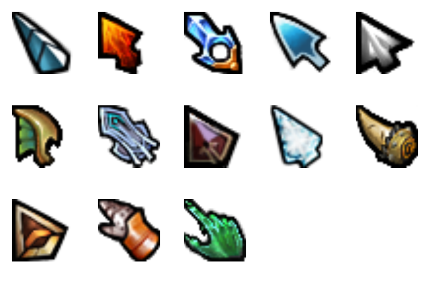

## Install

- **Linux** (Xcursor theme): see [linux/](linux/) - `./install.sh <pack> --apply`
- **Windows** (cursor scheme): see [windows/](windows/) - right-click a pack's
  `install.inf` and choose Install

Both live in this repo under [`linux/themes/`](linux/themes) and
[`windows/schemes/`](windows/schemes). Prefer a download over cloning? Grab a
per-pack archive from the
[Releases page](https://github.com/0443n/dota2-cursors/releases) (see
[Releases](#releases) below).

## Packs

Names are the real store names, taken from Dota's item files. The hero each pack
was made for is in parentheses.

<b>All 24 packs</b> - click to expand

| Preview | Pack | Folder |
|---------|------|--------|
|  | Acid Hydra (Venomancer) | `dota2-acid-hydra` |
|  | Wrath of Ka (Necrophos) | `dota2-wrath-of-ka` |
|  | DAC 2015 Mirana | `dota2-dac-2015-mirana` |
| 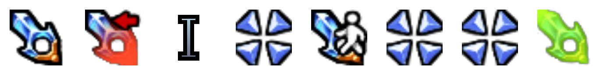 | DAC 2015 Crystal Maiden | `dota2-dac-2015-crystal-maiden` |
| 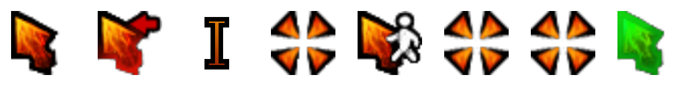 | DAC 2015 Chaos Knight | `dota2-dac-2015-chaos-knight` |
|  | Steam Chopper (Timbersaw) | `dota2-steam-chopper` |
|  | Unbroken Stallion (Centaur) | `dota2-unbroken-stallion` |
|  | Warcog (Clockwerk) | `dota2-warcog` |
|  | Tine of the Behemoth (Earthshaker) | `dota2-tine-of-the-behemoth` |
| 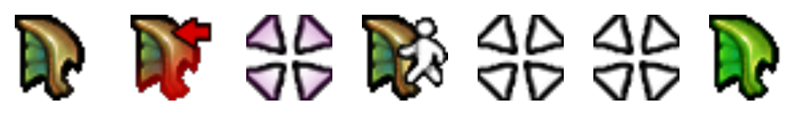 | Emerald Sea | `dota2-emerald-sea` |
| 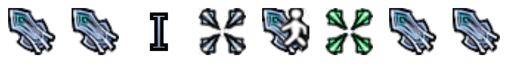 | Guardian of the Holy Flame (Sven) | `dota2-guardian-of-the-holy-flame` |
| 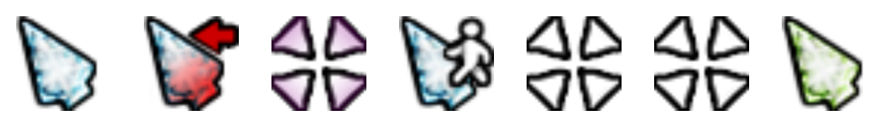 | The Summit 3 | `dota2-the-summit-3` |
|  | The International 2015 | `dota2-the-international-2015` |
| 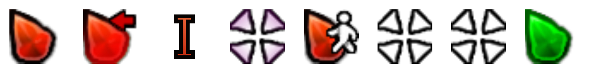 | The International 2016 | `dota2-the-international-2016` |
| 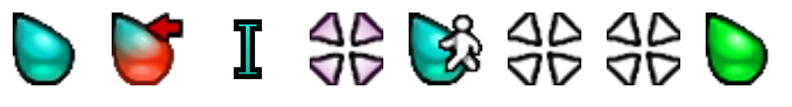 | The International 2017 | `dota2-the-international-2017` |
|  | The International 2018 | `dota2-the-international-2018` |
| 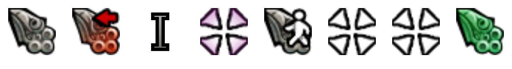 | The International 2019 | `dota2-the-international-2019` |
| 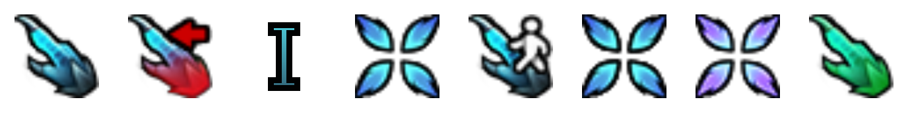 | The Devotions of Dragonus (Skywrath Mage) | `dota2-the-devotions-of-dragonus` |
|  | The Devotions of Dragonus, alt style (Skywrath Mage) | `dota2-the-devotions-of-dragonus-alt` |
| 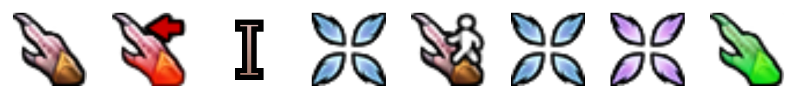 | The Resurrection of Shen (Vengeful Spirit) | `dota2-the-resurrection-of-shen` |
| 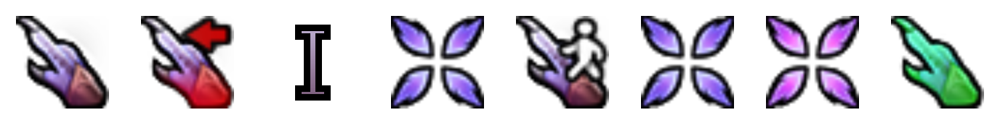 | The Resurrection of Shen, alt style (Vengeful Spirit) | `dota2-the-resurrection-of-shen-alt` |
| 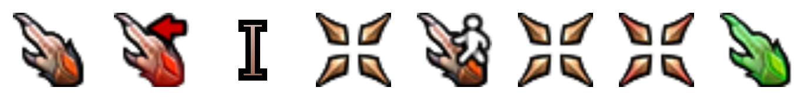 | The Resurrection of Shen, Imperia style (Vengeful Spirit) | `dota2-the-resurrection-of-shen-imperia` |
|  | Diretide 2020 | `dota2-diretide-2020` |
|  | Default | `dota2-default` |

Each row shows, left to right: arrow, link, text, crosshair, move, drag, not-allowed, help.

## Releases

Grab archives from the
[Releases page](https://github.com/0443n/dota2-cursors/releases). Each release
ships one drop-in archive per pack per platform:

- **Linux:** `<pack>.tar.gz` - `tar xf <pack>.tar.gz -C ~/.local/share/icons/`,
  then pick it in your cursor settings.
- **Windows:** `<pack>.zip` - extract, then right-click `install.inf` and choose
  Install.

## Notes

The cursors scale. Each ships several sizes (Linux packs carry 24 up to 192 px)
so the cursor-size slider works. The art starts from Dota's 32px originals, so
large sizes are upscaled and look a little soft up close.

They're static. Dota's cursor files are single frames; the glow and motion you
see in-game come from the engine while you play, not the art itself.

The caret is drawn. Dota has no text cursor, so the I-beam is original work,
drawn to match each pack and tinted from its own arrow. The busy and resize
cursors still have no Dota art, so those reuse the arrow and move.

## Artwork

Fan project, not affiliated with Valve. Nearly all the cursors are Valve's
artwork, taken from Dota 2 for personal desktop use; the text caret is the one
original addition. See [DISCLAIMER.md](DISCLAIMER.md).
